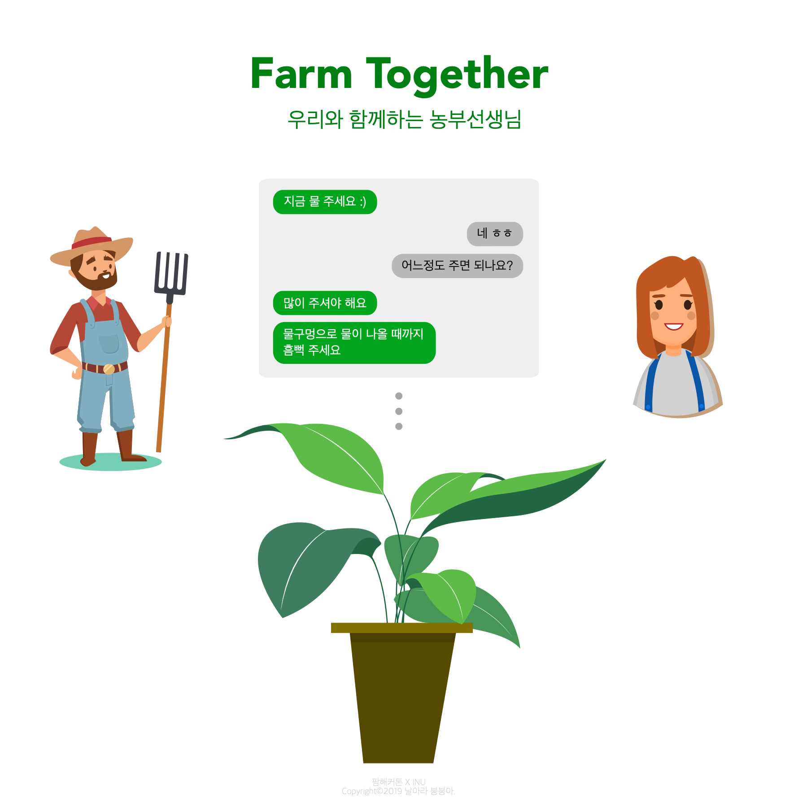

# fly-boong-boong

###### 날아라 붕붕아!

농촌과 도시가 만나 신나는 ‘작당’을 하다. Design thinking 해커톤 참가팀 **날아라 붕붕아**입니다.

## 팜해커톤 X INU

#### 새롭고 놀라운 변화를 꿈꾸는 (체인지)메이커들이 농촌의 유무형 자원을 활용해 1·2·3차 산업간 융복합함으로써 농업의 부가가치 제고 및 도·농간 교류를 촉진하는 창의혁신 프로젝트(아이템 및 사업모델) 발굴 및 실행.

도시와 농촌의 상생 아이디어를 제시하고 추진하는 프로젝트입니다.
INU 문화기획단, [팜메이트](https://farmate.kr), [넷임팩트](https://ko-kr.facebook.com/netimpactkr/)와 함께합니다.

## 팀 소개

*날아라 붕붕아* 팀은 세 명의 컴퓨터공학 전공자로 이루어져 있습니다. 각자 문제를 찾아내어 개선책을 제시하고 실천하는 일에 익숙합니다. 전공이 같아 자칫 신선하지 않을 것 같지만 배경과 성향이 모두 심하게 달라 함께 모였을 때에 **엄청난 시너지**를 발휘합니다.

팀원은 다음과 같습니다. (가나다순)

#### [강은선](https://github.com/dobbi030)

- 팀의 우두머리.
- 아이디어뱅크. 일 잘함.

#### [노승범](https://github.com/Tenser)

- 천재.
- 일반인을 아득히 뛰어넘는 사고방식을 보유.

#### [송병준](https://github.com/potados99)

- 구현머신.
- 시키면 만들어냄.

## 팀 프로젝트 "Farm Together"

#### 농작 베테랑과 함께 키우는 작물

식물을 키우려고 하거나 농사를 마음먹었을 때에, 어떻게 시작해야 할 지 막막한 경우가 많습니다. 매뉴얼화되고 데이터베이스화된 농작 노하우, 그리고 농부 선생님의 도움과 함께라면 농사가 훨씬 쉬워질 것입니다.

#### 모바일 애플리케이션을 통한 실시간 조언

논이나 밭에서 농사를 짓는 것은 물론이고, 집에서 작은 식물을 키우는 것에도 때가 있는 법입니다. 적절한 시기에 적절한 일을 수행해야 식물이 무럭무럭 자라날 수 있습니다.

*Farm Together*는 농사에 필요한 조언들을 실시간으로 전달해줍니다. 잘 정리된 농작 매뉴얼에 따라 해야 할 일을 알려주는 것은 물론이며, 궁금한 것이 생기면 농부님께 직접 문의할 수도 있습니다.

#### 다른 사람들과 함께하는 커뮤니티
혼자서 하는 일은 금방 흥미를 잃고 지치기 쉽습니다. 식물을 키워내는 경험을 공유할 수 있는 커뮤니티를 제공하여 사람들과 소통할 수 있게 함으로써 농작 활동에 대한 동기를 꾸준히 부여합니다. 도시인과 농업인 모두 참여하는 지역 농업 커뮤니티로서 도시와 농촌을 이어주는 역할도 수행합니다.

## 사업 계획

- [사업계획서](documents/farm-together-business-plan.pdf)

(작성중)
